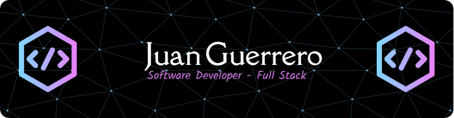
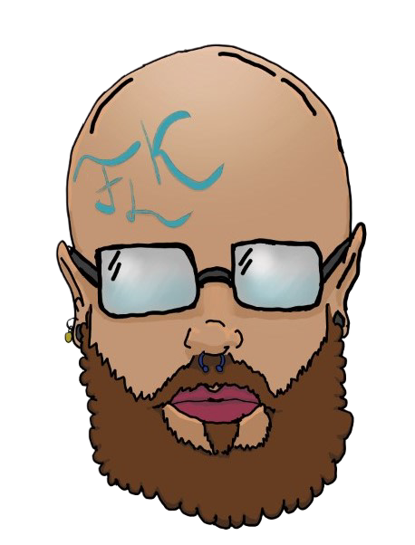

  

# 💫 About Me:
🔭 I’m currently studing in the course 42Málaga  🤖 I´ve studied in a Bootcamp 4GeeksAcademy  🌱 I’m currently learning C in 42Málaga  👯 I’m looking to collaborate whit any interesting proyect  🤝 I’m looking for any help or correction, If you can help me to improve any area don´t hesitate to contact me   👨‍💻 All of my projects are available at https://github.com/Folkenciyo?tab=repositories  💬 Ask me about any question you have!  📫 How to reach me juanguerrero.dev@gmail.com  ⚡ Fun fact I really like Games and Art, for that reason I love drawing, painting and 3D modeling also

## 🌐 Socials:
       

# 💻 Tech Stack:
           	    
# 📊 GitHub Stats:
|   |   |  |
|:-:|:-:|:-:|

## 🏆 GitHub Trophies

## 🐦 Telefonica 42 Progress

### ✍️ Random Dev Quote

### 🔝 Top Contributed Repo

<!--### 😂 Random Dev Meme  -->
---
  ## 💰 You can help me by Donating
   
---
  
